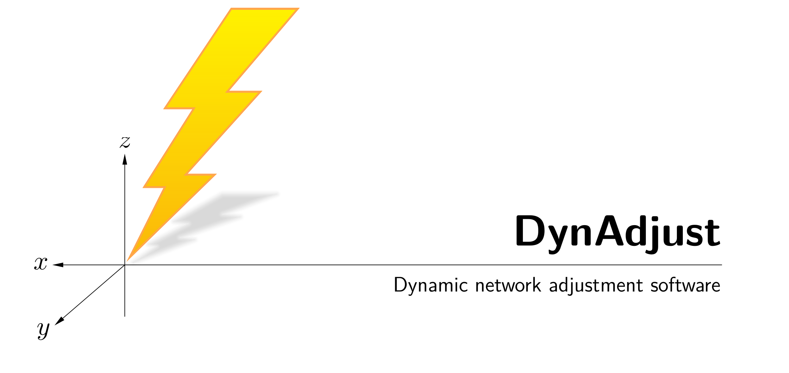

## Contents

- [Contents](#contents)
- [Overview](#overview)
- [Installation](#installation)
  - [Building from source](#building-from-source)
    - [General requirements and prerequisites](#general-requirements-and-prerequisites)
    - [Linux / Mac OS X build requirements](#linux--mac-os-x-build-requirements)
    - [Windows build requirements](#windows-build-requirements)
- [Feedback](#feedback)
- [User's guide](#users-guide)
- [Creating images](#creating-images)
- [License details](#license-details)

## Overview

DynAdjust is a rigorous, high performance least squares adjustment application. It has been designed
to estimate 3D station coordinates and uncertainties for both small and extremely large geodetic networks,
and can be used for the adjustment of a large array of Global Navigation Satellite System
(GNSS) and conventional terrestrial survey measurement types. On account of the phased adjustment
approach used by DynAdjust, the maximum network size which can be adjusted is effectively
unlimited, other than by the limitations imposed by a computer’s processor, physical memory and
operating system memory model. Example projects where DynAdjust can and has been used include
the adjustment of small survey control networks, engineering surveys, deformation monitoring
surveys, national and state geodetic networks and digital cadastral database upgrade initiatives.

DynAdjust provides the following capabilities:

- Import of data in geographic, cartesian and/or projection (UTM) coordinates contained in DNA, DynaML and SINEX data formats;
- Input of a diverse range of measurement types;
- Transformation of station coordinates and measurements between several static and dynamic reference frames;
- Rigorous application of geoid–ellipsoid separations and deflections of the vertical;
- Simultaneous (traditional) and phased adjustment modes;
- Automatic segmentation and adjustment of extremely large networks in an efficient manner;
- Rigorous estimation of positional uncertainty for all points in a network;
- Detailed statistical analysis of adjusted measurements and station corrections;
- Production of high quality network plots;
- Automated processing and analysis with minimal user interaction.

## Installation

Windows (64-bit) executables can be downloaded from the [releases page](https://github.com/icsm-au/dynadjust/releases/latest).

In addition, the following (64-bit) libraries need to be installed:

- Apache Xerces-C++ XML Parser: <http://xerces.apache.org/xerces-c/download.cgi>
- Codesynthesis XSD XML Data Binding for C++: <https://www.codesynthesis.com/products/xsd/download.xhtml>
- Intel Math Kernel Library: <https://software.seek.intel.com/performance-libraries>

### Building from source

The following build instructions are only needed if you would like to build DynAdjust on Windows, Linux or Apple operating systems.

#### General requirements and prerequisites

- A C++14 compiler, such as gcc, Microsoft Visual Studio or Apple LLVM (clang)
- Boost C++ headers and libraries
- Apache Xerces C++ headers and libraries
- Codesynthesis XSD headers and libraries
- Intel Math Kernel Library (MKL) headers and libraries

#### Linux / Mac OS X build requirements

Download the following files from the [resources](https://github.com/icsm-au/DynAdjust/tree/master/resources) folder to a dedicated build folder on your computer, and run in order:

1. `install_dynadjust_prerequisites.sh`
2. `make_dynadjust_gcc.sh`

Executing `install_dynadjust_prerequisites.sh` will download all the prerequisites required to build DynAdjust (boost, xerces-c, xsd, mkl).  Options are provided for installing xerces-c and xsd prerequisites via Package Manager or downloading and building from source.

Executing `make_dynadjust_gcc.sh` will clone the latest version of DynAdjust, build it in the directory `./build-gcc/` and install to `/opt/dynadjust/gcc/x_x_x/`. Symbolic links to the binaries (installed to `/opt/dynadjust/`) will be created in the user's `~/bin` folder.

#### Windows build requirements

Please refer to the Windows compilation [instructions](https://github.com/icsm-au/DynAdjust/blob/master/resources/dynadjust-compilation-in-windows.pdf) for the steps to compile DynAdjust on Windows using Microsoft's freely available Visual Studio 2017 Community Edition.

## Feedback

To suggest an enhancement to the functionality of DynAdjust, or to report a defect or unexpected behaviour, please submit your query via [our issue tracker](https://github.com/icsm-au/dynadjust/issues).

## User's guide

A comprehensive User's Guide can be found in the [resources](https://github.com/icsm-au/DynAdjust/tree/master/resources) folder.  The User's Guide provides information about the history of DynAdjust, its architecture and algorithms, its usage, supported file format specifications and basic command-line examples.

## Creating images

DynAdjust provides a capability to generate publication-quality images of raw station and measurement data and adjustment results, including shift vectors and estimated uncertainty, in a variety of projection types. This capability is made available by the program **plot**, the command line reference for which is documented in Appendix A.7 of the [User's guide](#users-guide).

  

  
DynAdjust uses the Generic Mapping Tools (GMT), available from the [GMT website](https://www.generic-mapping-tools.org/download/). Users should note however, that DynAdjust supports [GMT 4.x.x](https://github.com/GenericMappingTools/gmt/wiki/GMT-4.5.18) and earlier versions only. Hence, GMT versions 5.x.x and 6.x.x. cannot be used. See [issue #30](https://github.com/icsm-au/DynAdjust/issues/30) for details of planned development to provide support for the latest version of GMT.

## License details

DynAdjust has an Apache 2.0 Licence - http ://www.apache.org/licenses/LICENSE-2.0.

NOTE: DynAdjust makes use of Boost C++, Apache's Xerces-C++ XML Parser (Apache 2.0 Licence) and CodeSynthesis XSD code. Hence, the following licence agreements will also need to be taken into account with the Apache 2.0 Licence.

- <https://www.boost.org/users/license.html>
- <https://www.codesynthesis.com/products/xsd/license.xhtml>

The free licence of CodeSynthesis XSD is GPL2, which requires any software that uses it to also be open source.  However, the CodeSynthesis site above states that you can use XSD generated code in proprietary applications provided that the lines of code do not exceed 10,000 lines.  The files generated for DynaML from XSD (dnaparser_pimpl.hxx/cxx and dnaparser_pskel.hxx/cxx), all of which have been heavily modified after they were originally generated, contain less than 10,000 lines.

DynAdjust also makes use of Intel's performance libraries - Math Kernel Library (MKL) and Threaded Building Blocks (TBB). Given the size of the associated libraries, it is not possible to upload the binaries to this site. Please visit the following website to download the latest versions:

- <https://software.seek.intel.com/performance-libraries>

As stated on this website, Intel's performance libraries are *free to use for personal and commercial applications.*
